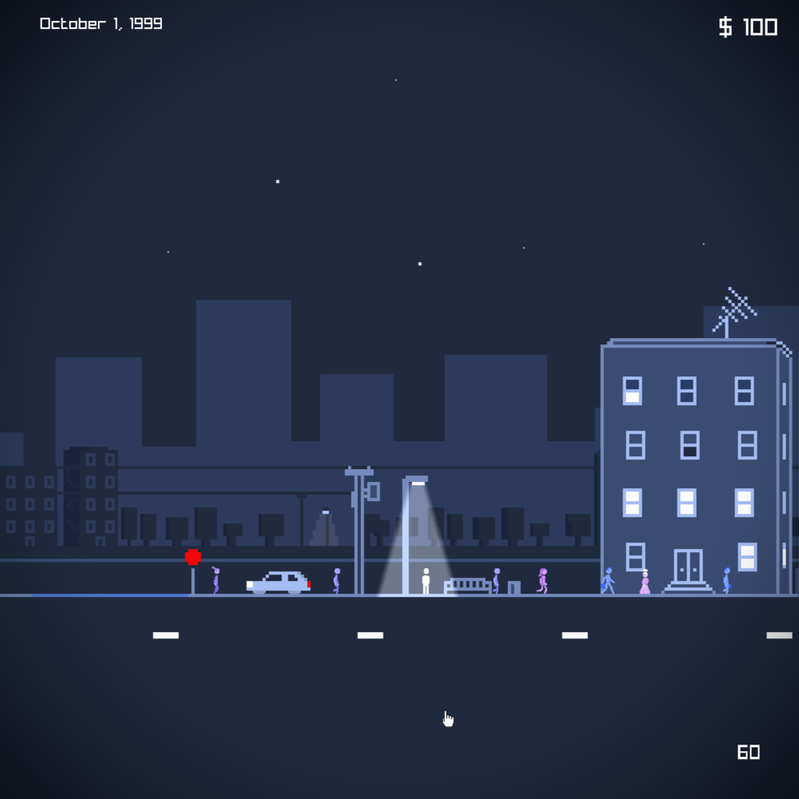

# DeadCityNights

**DeadCityNights** is point and click, pixel art adventure game developed in C++ using raylib. 

## Features
- **Multiple Locations**: City streets, apartment, a cemetery, and more.
- **Combat**: Shoot zombies with guns.
- **Inventory System**: Collect items like car keys and a shovel.
- **NPC Dialog**: Randomized phrases from NPCs you encounter on the street.
- **Take Drugs**: Buy drugs off of a dealer on the street.
- **Shader Effect**: Different shader effects will play depending on the situation.
- **Voice Acting**: Custom made zombie grunts and moans.

## Installation
The release is a very early alpha version. Unzip and run game.exe. Windows only for now. 

## Controls
Arrow keys left and right or A and D to move. Press up to interact with environment. Press up or click on NPCs to talk to them. Right click or F to aim. Left click or space while aiming to shoot. 1 selects handgun. 2 selects shotgun. Guns only work in the cemetery.

## Notes
I've been programming in python and making games in Godot with gd script for like 3 years. I've always wanted to learn C++ so I could eventualy make bigger and better things, but you got to start small. So I'm making a pixel art adventure game in C++ with raylib. I started by taking a piece of pixel art I had made and slowly made it more and more interactive. I added a player character and a camera, then pedestrians, then other areas, and so on until it's like a 15 minute long game you can play.

Once I found out how easy it is to use shaders in raylib, I had the idea of making visual effects for the players state of mind. Like you can buy drugs off a dealer on the street, and when you take them I activates a glow shader that makes it look like the player is high. When zombies are spawning I play a glitch shader that adds to the tension. I also made a drunk shader, but havn't implemented booze yet. Since the style of the game is so simple, shaders can add some more art to the game, that I don't have to draw manualy. 

This has been the perfect project to learn C++. Making a game with no engine requires you to structure the whole thing yourself. You have to think about all the peices of the puzzle and how they will fit together in the future. I scrapped and rewrote the whole game like 3 times when I first was starting. I put all the big things into their own seperate classes with header and cpp files, and it has helped keep things orginized enough for me to keep adding to it without breaking it, while I better learn cpp. 

I post about making the game on twitter. https://x.com/J_Hyde_
Check out the other games I have made. https://jhyde.itch.io