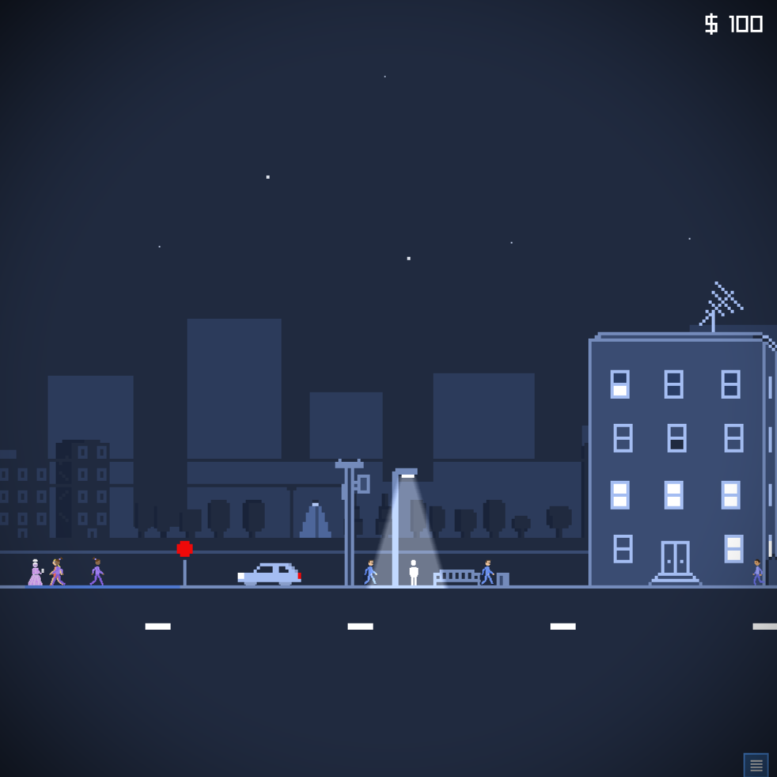

# DeadCityNights

**DeadCityNights** is a pixel art adventure game/platformer developed in C++ using raylib.  

## Features
- **Multiple Locations**: City streets, apartment, a cemetery, and more.
- **Combat**: Shoot zombies with guns.
- **Inventory System**: Collect items like car keys and a shovel.
- **NPC Dialog**: Randomized phrases from NPCs you encounter on the street.
- **Take Drugs**: Buy drugs off of a dealer on the street.
- **Shader Effect**: Different shader effects will play depending on the situation.
- **Voice Acting**: Custom made zombie grunts and moans.

## Installation
The release is a very early alpha version. Unzip and run game.exe. Windows only for now. 

## Controls
Arrow keys left and right or A and D to move. Press up to interact with environment. Press up or click on NPCs to talk to them. Right click or F to aim. Left click or space while aiming to shoot. 1 selects handgun. 2 selects shotgun. 3 selects mac10. 

## Notes
I've been programming in python and making games in Godot with gd script for like 3 years. I've always wanted to learn C++ so I could eventually make bigger and better things. I thought a good way to learn C++ would be to make a game in it. I've seen people on the internet using raylib and I thought it would be perfect for my needs. I have used pygame a little in the past and knew how a game loop worked. I knew how classes worked from programming in python, so all this knowledge transfered over to cpp and raylib. The syntax is a little different but I'm still doing the same things I did in Godot I just dont have a GUI to place things in the world, and all the classes and structures I need to make myself, but I find that to be the fun part. Since this is my first thing in cpp I wanted to keep it simple and do what I know. So this game is like minimalist art. I started by taking a pixel art image I had made and slowly made it more and more interactive. I added a player character and a camera, then pedestrians, then other areas, and so on. 

There are eight different areas you can visit so far. The player character has an apartment and a car. You can use the car to drive to different areas like the park, or the cemetery. You encounter zombies in the cemetery as part of a story arc I'm working on. You combat zombies with two different types of guns. The revolver and the shotgun. Zombies rise from their grave on either side of the player when spawning in. This makes the combat a bit tricky and fun. I think at some point I want to add human enemies. Dudes with guns. But I'm still thinking about it. 

Besides the combat there are also NPCs to interact with. On main street of the game there are generic NPCs of different types that walk back and forth to different randomly set destinations. They will give one line greeting to the player. There are also special NPCs. Like the drug dealer, fortune teller, and police man. There is also a story character. A hobo who lives in the vacant lot by your apartment. He warns you about the zombies and gives you certain needed items. 

*update*
I've been working on the game for six months now. From what I have written down, there should be 16 different scenes in the game by the time I'm finished. I am up to 13 right now, so I'm not that far off. There are still a couple side missions I need to design. Then at some point I need to research how to make it into a stand alone executable, and I'm still looking for the right music. 

The current music I made myself and can get repetitive. I'm not in the right headspace to be writing music right now, so I guess I'm on the lookout for music I can freely use. What I really want is a few different tracks. One for on the street, a different one for the astral realm, and maybe battle music that plays when zombies are spawning and such. 

I'm also on the look out for voice sound effects. Right now the NPCs can speak gibberish, but the audio clip I cut apart isn't that great. I just need some good babble that sounds better than what I have now. 

Other than that, things are going swimmingly. I have been going hard for like 2 weeks straight and getting work done. This kind of productivity can't last though. I think taking that 2 week break really help recharged my motivation to finish this thing.

I post about making the game on twitter. https://x.com/J_Hyde_
Check out the other games I have made. https://jhyde.itch.io